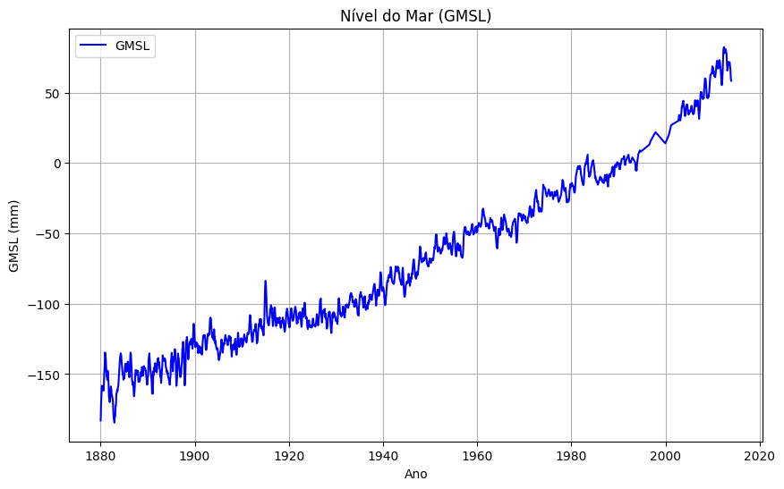
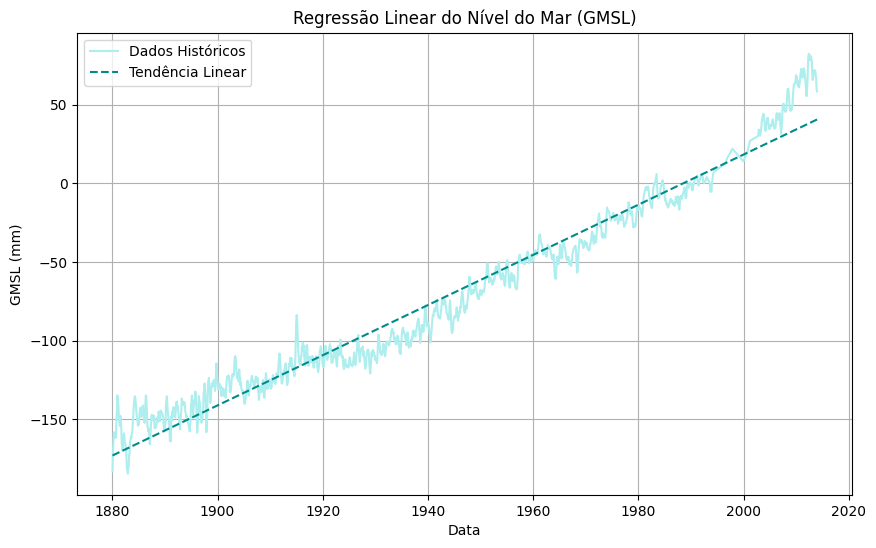
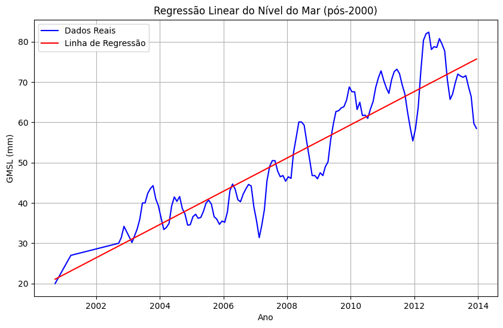

# Análise do Nível Médio Global do Mar (GMSL)

Este projeto realiza uma análise detalhada do nível médio global do mar (GMSL), utilizando uma base de dados pública que abrange medições históricas. O objetivo é explorar tendências, calcular a taxa média de elevação e visualizar os dados por meio de gráficos. Foram implementadas funções que incluem a análise de regressão linear para destacar a tendência geral, com foco especial nos dados pós-2000.

## Funcionalidades do Projeto

- **Cálculo da Diferença GMSL**: Determina a diferença entre o primeiro e o último ponto de dados.
- **Taxa Média de Elevação**: Calcula a taxa média de elevação do GMSL ao longo do período de estudo.
- **Visualização dos Dados**: Gráficos que mostram a variação do GMSL e a linha de tendência obtida pela regressão linear.
- **Análise Pós-2000**: Uma seção focada em examinar os dados coletados após o ano 2000, com gráficos específicos.
- **Medições de Incerteza**: Identifica datas de incertezas máximas e mínimas nos dados.

## Pré-visualização dos Gráficos

### Gráfico de Variação do GMSL

### Regressão Linear do Nível do Mar (Geral)

### Regressão Linear do Nível do Mar (pós-2000)

## Estrutura do Código

- **Bibliotecas Usadas**: `pandas`, `numpy`, `matplotlib`, `scikit-learn`
- **Funções Importantes**:
  - `gmsl_difference(df)`: Calcula a diferença entre a primeira e a última medição.
  - `avg_rate_sea(df)`: Retorna a taxa média de elevação do GMSL.
  - `linear_regression(df)`: Realiza a regressão linear no dataset completo.
  - `linear_regression_post_2000(df)`: Realiza a regressão linear nos dados pós-2000.
  - Funções para visualizar os dados e as linhas de tendência.

## Resultados e Discussão

Os gráficos mostram uma tendência de elevação constante do nível do mar, com uma análise específica que destaca os dados pós-2000, fornecendo insights sobre mudanças recentes. A linha de regressão indica um aumento contínuo, alinhado com estudos sobre aquecimento global.
